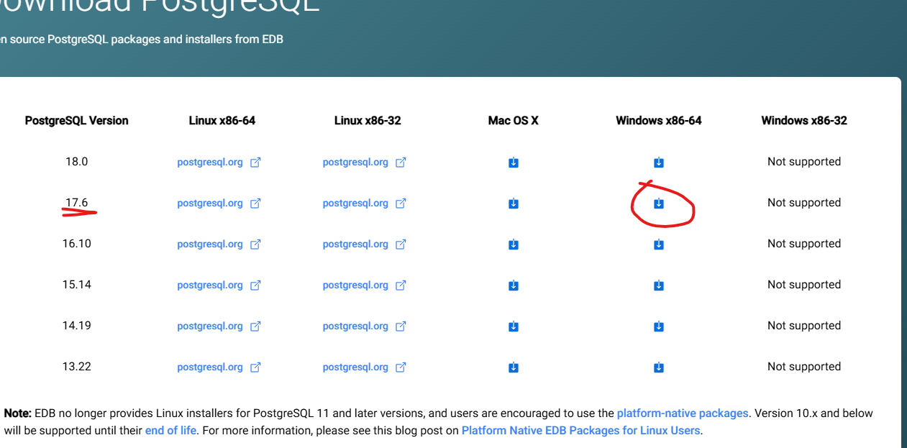
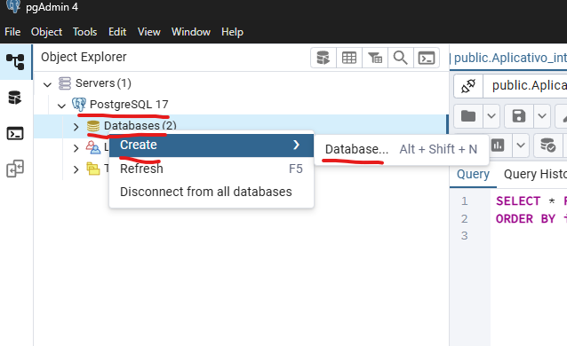
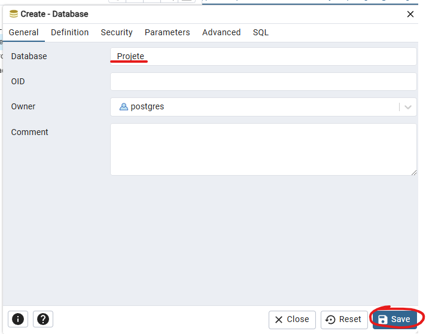
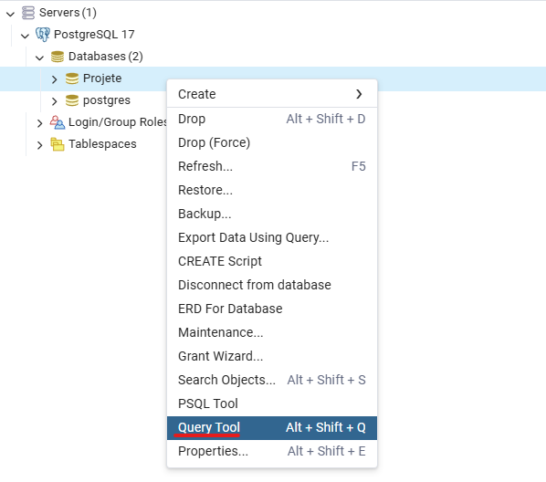
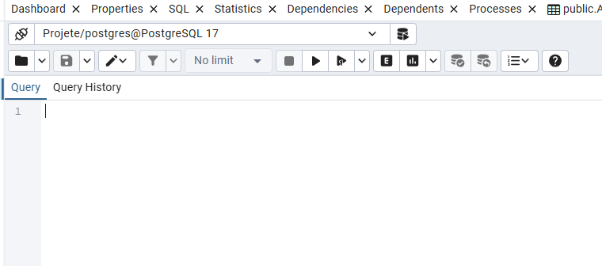
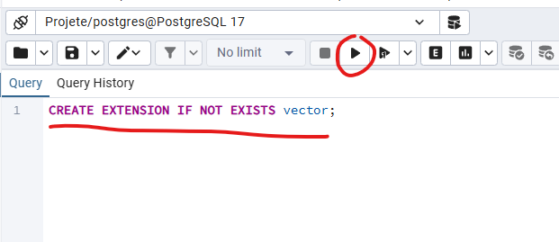
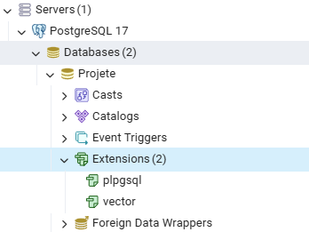

# Guia de Instalação do PostgreSQL

Este guia vai te ensinar passo a passo como instalar o **PostgreSQL** no seu computador, para você poder rodar projetos que utilizam bancos de dados PostgreSQL.

E também as brincadeirinhas que precisa pra rodar o backend

---

## 1. Baixar o PostgreSQL

1. Acesse o site oficial do PostgreSQL: [https://www.postgresql.org/download/](https://www.postgresql.org/download/)
2. Escolha seu sistema operacional (provavelmente **Windows**)
3. Clique em **Download the installer**  

4. Baixe a **versão 17.6** (o motivo é explicado mais abaixo)  


---

## 2. Instalar o PostgreSQL no Windows

1. Execute o instalador baixado.
2. Selecione os componentes:
    - **PostgreSQL Server**
    - **pgAdmin 4** (interface gráfica, dashboard style)
    - **Stack Builder** (opcional, pode desmarcar)
3. Use o diretório padrão.
4. Configure a **senha do usuário `postgres`**: `PROJ3405` (igual ao `settings.py` do Django).

    - Durante a instalação, o assistente pedirá uma senha para o usuário administrador padrão do PostgreSQL (chamado `postgres`).
    - Defina a senha como: `PROJ3405`
    - Essa senha é a usanda em settings.py do backend django

5. Porta padrão: `5432`.
6. Continue até terminar a instalação.

    

7. Se abrir isso, **feche sem medo** (n vamo usar)

---

## 3. Criar o banco de dados "Projete"

Depois de instalar o **PostgreSQL**:

1. Abra o **pgAdmin 4** e conecte ao servidor local (`localhost`, usuário `postgres`, senha `PROJ3405`).
2. Clique com o botão direito em **Databases → Create → Database…**  

3. Preencha:

    - **Database**: `Projete`
    - **Owner**: `postgres`

    
    > OID pode ficar vazio. eu acho
4. Clique em **Save** ✅  

> Banco `Projete` pronto para o backend do Django.

---

## 4. Instalar a extensão `pgvector` (pré-compilada)

O backend usa **pgvector** pra guardar vetores (embeddings).  

Compilar do zero é um pesadelo no Windows, então vamos usar uma versão pré-compilada.

Acontece que essa versão pre-compilada só vai até a versão 17.6 do PostgreSQL, eis a necessidade de instalar essa versão e não a versão mais recente

### Passo 1: Baixar a extensão pre-compilada

1. Vá para: [https://github.com/andreiramani/pgvector_pgsql_windows](https://github.com/andreiramani/pgvector_pgsql_windows)
2. Em Releases, baixe a versão correta para **PostgreSQL 17, Windows**.
3. Extraia o conteúdo numa pasta fácil de achar.

### Passo 2: Copiar arquivos da extensão para o PostgreSQL

1. Localize a pasta de instalação do PostgreSQL:  
C:\Program Files\PostgreSQL\17\

2. Na pasta extraída da extensão, encontre:
    - `include`
    - `lib`
    - `share`
3. Copie essas pastas para a **pasta base do PostgreSQL** (`17/`).  
   - Se perguntar sobre substituir arquivos, clique **Sim**.
4. Agora a extensão está disponível pro banco `Projete`.

### Passo 3: Habilitar a extensão no banco

1. No **pgAdmin**, conecte ao banco `Projete`.
2. Abra a **Query Tool** no banco de dados onde quer instalar a extensão (no nosso caso, `Projete`):  

3. A tela deve se parecer com algo assim:  

4. Digite o comando abaixo e clique em **Execute Script**:  


    ```sql
    CREATE EXTENSION IF NOT EXISTS vector;
    ```

5. Se não der erro, a extensão foi instalada com sucesso.

## 5. Verificando a instalação

1. Abra a aba Extensions dentro do banco Projete no pgAdmin4:

    

2. Verifique se vector está presente como na imagem, se estiver, a extensão foi instalada no banco de dados

>Também é possível verificar via PSQL Tool (menu acima da Query Tool) rodando:

```sql
\dx
```

> Se aparecer vector, tudo certo!

Agora o banco ```Projete``` está pronto para o backend do Django, com **pgvector ativo.**

## Resumo rápido (TL;DR)

- **Banco:** `Projete`  
- **Usuário:** `postgres` (senha `PROJ3405`)  
- **Extensão:** `pgvector` via binário pré-compilado  
- **Verificação:** comando `\dx` ou aba `Extensions` do pgAdmin4
